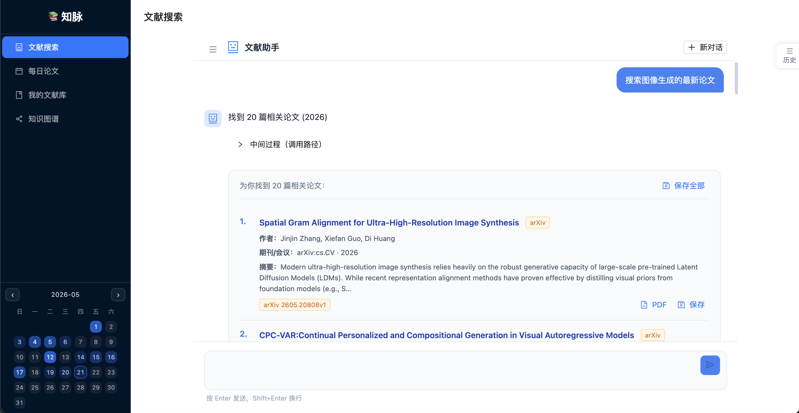
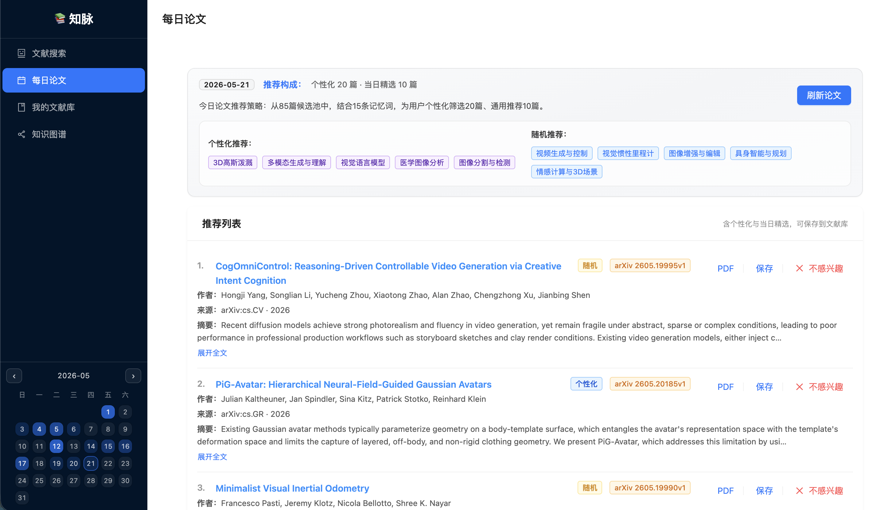
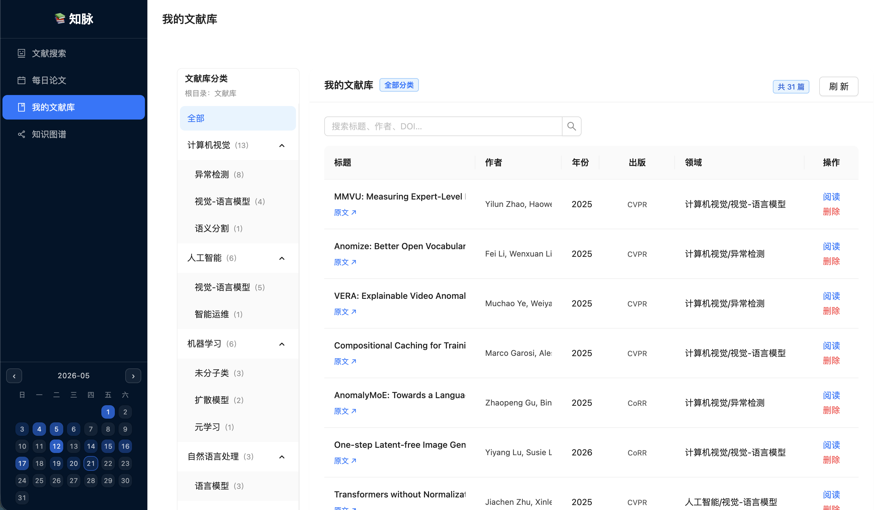
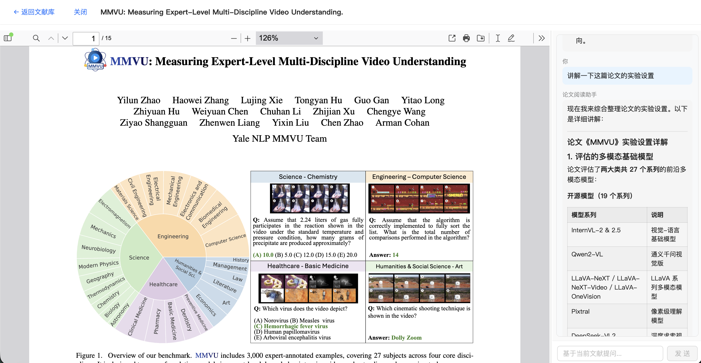
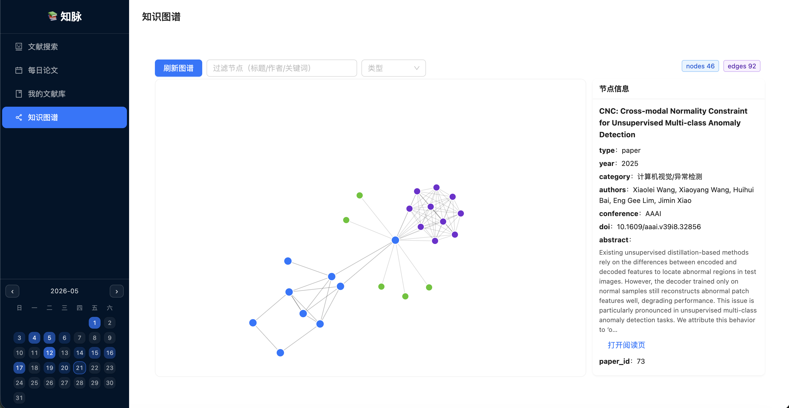

# PaperGraph（知脉）- 面向研究者的智能文献工作台

<div align="center">

**Academic Paper Search, Reading, Recommendation and Knowledge Graph Workspace**

[](https://www.python.org/downloads/)
[](https://fastapi.tiangolo.com/)
[](https://vuejs.org/)
[](LICENSE)

*基于 HelloAgents 构建的学术文献搜索、阅读、推荐与知识图谱系统*

*把找论文、读论文、管理论文和沉淀研究脉络串成一个连续工作流*

</div>

---

## 项目简介

PaperGraph（知脉）是一个面向科研学习、论文调研和研究方向跟踪的智能文献工作台。系统以 SearchAgent、PaperAnalysisAgent 和 KnowledgeGraphAgent 为核心，将自然语言检索、多源论文召回、PDF 阅读问答、每日推荐、文献保存和知识图谱构建整合到同一个 Web 应用中。

它希望解决研究者在日常文献工作中的几个高频痛点：

- 关键词检索分散在多个平台，结果需要手动筛选、去重和排序
- 阅读论文时缺少上下文辅助，方法、实验、引用关系难以持续沉淀
- 每日新论文、个人文献库和知识图谱彼此割裂，难以形成长期研究记忆
- 从发现论文到保存、阅读、追问、归类之间缺少一条顺滑的工作流

### 核心特性

- **自然语言文献搜索**：输入研究问题、论文标题、作者或会议线索，由 LLM 解析意图并生成 SearchRecipe
- **多源并行召回与精排**：整合 arXiv、DBLP、OpenAlex 与 Tavily 线索，完成去重、过滤、排序和兜底召回
- **论文阅读助手**：支持 PDF 正文抽取、AI 导读、阅读对话、参考文献查找和表格上下文辅助
- **每日论文推荐**：根据用户兴趣选择 arXiv 分类，生成个性化候选论文与推荐理由
- **我的文献库**：支持论文保存、PDF 下载、分类管理、阅读记录和阅读日历
- **知识图谱构建**：从已保存论文中抽取主题、方法、引用和相关关系，并进行可视化浏览
- **多智能体共享记忆**：通过 GSSC（Gather -> Score -> Select）流水线选择上下文，减少重复信息干扰

### 技术亮点

- **Recipe 驱动检索**：将 LLM 对用户意图的理解转成可执行检索计划，降低硬编码特殊路径依赖
- **多源召回与优雅降级**：arXiv、DBLP、OpenAlex 和 Tavily 互为补充，单一来源失败时仍尽量返回可用结果
- **流式过程反馈**：搜索过程通过 SSE 返回阶段状态和工具调用摘要，便于用户理解结果来源
- **阅读上下文增强**：阅读器结合论文正文、表格、参考文献和历史记忆回答问题，而不只是展示 PDF
- **共享记忆机制**：多个 Agent 共享论文、偏好和反馈上下文，让后续搜索与推荐更贴近用户兴趣
- **前后端契约生成**：通过 OpenAPI 导出前端类型，减少接口字段漂移

## 应用场景

### 适合谁使用？

- **研究生/博士生**：快速进入新方向，建立论文阅读和调研脉络
- **科研工作者**：跟踪每日新论文，沉淀个人文献库和主题关系
- **AI/工程研发人员**：围绕技术问题快速查找论文、保存证据和复盘方法
- **课程学习者**：用对话式阅读辅助理解论文方法、实验和引用背景

### 典型使用场景

1. **主题调研**：输入研究问题 -> 多源召回论文 -> 保存候选论文 -> 形成阅读列表
2. **论文精读**：打开 PDF -> 获取 AI 导读 -> 围绕方法、实验和局限继续追问
3. **每日跟踪**：系统拉取新论文 -> 个性化推荐 -> 保存感兴趣论文 -> 反馈偏好
4. **知识沉淀**：从文献库抽取关系 -> 生成图谱 -> 观察主题、作者和论文之间的连接

## 系统架构

### 整体架构

```text
┌──────────────────────────────────────────────────────────────┐
│                         前端界面层                            │
│  文献搜索 | 每日论文 | 我的文献库 | 论文阅读助手 | 知识图谱       │
└──────────────────────────────────────────────────────────────┘
                              │
                              │ REST + SSE
                              ▼
┌──────────────────────────────────────────────────────────────┐
│                         API 接口层                            │
│              FastAPI Routes + OpenAPI + Tool Events           │
└──────────────────────────────────────────────────────────────┘
                              │
                              ▼
┌──────────────────────────────────────────────────────────────┐
│                       智能体编排层                             │
│  SearchAgent | PaperAnalysisAgent | KnowledgeGraphAgent        │
└──────────────────────────────────────────────────────────────┘
                              │
                              ▼
┌──────────────────────────────────────────────────────────────┐
│                         核心服务层                            │
│  Search Pipeline | PDF Parser | Daily Recommend | AgentMemory  │
└──────────────────────────────────────────────────────────────┘
                              │
                              ▼
┌──────────────────────────────────────────────────────────────┐
│                         数据持久层                            │
│       SQLite 文献库 | PDF 文件存储 | 阅读记录 | 反馈记忆          │
└──────────────────────────────────────────────────────────────┘
```

### 三类智能体

| 智能体 | 职责 | 核心能力 |
|--------|------|----------|
| **SearchAgent** | 文献搜索与结果解释 | 意图解析、SearchRecipe、多源召回、LLM 精排 |
| **PaperAnalysisAgent** | 论文阅读与分析 | 摘要生成、标签归类、阅读问答、引用查找 |
| **KnowledgeGraphAgent** | 知识图谱构建 | 论文关系抽取、图谱数据生成、节点详情解释 |

### 搜索链路

```text
用户问题
  -> LLM 意图解析
  -> SearchRecipe
  -> arXiv / DBLP / OpenAlex / Tavily 多源召回
  -> 去重与过滤
  -> LLM 精排
  -> 结果解释与保存
```

## Quick Start

### 1. 环境要求

- Python 3.10+
- Node.js 18+
- 可用的 OpenAI 兼容 LLM 服务

### 2. 后端安装与配置

```bash
cd backend
pip install -r requirements.txt
```

在 `backend/.env` 中配置模型信息：

```env
LLM_API_KEY=your_api_key
LLM_BASE_URL=https://your-openai-compatible-endpoint/v1
LLM_MODEL_ID=your_model_id
```

启动后端：

```bash
python run.py
```

默认访问地址：`http://localhost:8000`

### 3. 前端安装与启动

```bash
cd frontend
npm install
npm run dev
```

默认访问地址：`http://localhost:5173`

### 4. 一键启动

也可以在项目根目录执行：

```bash
./start.sh
```

## 使用流程

1. 在 **文献搜索** 页面输入自然语言问题，例如“2024 年视觉语言模型中的 grounding 相关论文”。
2. SearchAgent 解析检索意图，选择关键词、来源、年份、会议等约束，并执行多源召回。
3. 用户将有价值的论文保存到 **我的文献库**，必要时下载 PDF。
4. 在 **我的文献库** 中打开某篇论文，进入 **论文阅读助手** 页面查看 AI 导读，并围绕方法、实验、局限和参考文献继续提问。
5. 在 **每日论文** 页面追踪新论文，在 **知识图谱** 页面观察主题和论文之间的关系。

## 演示效果

### 文献搜索与结果召回



### 每日论文推荐



### 我的文献库



### 论文阅读助手

在 **我的文献库** 中点击论文的“阅读”入口，即可进入论文阅读助手页面，进行 PDF 阅读、AI 导读和基于当前论文的问答。



### 知识图谱



## 技术栈

| 层级 | 技术 |
|------|------|
| **智能体框架** | HelloAgents（SimpleAgent + ToolRegistry + CircuitBreaker + ContextBuilder） |
| **后端服务** | FastAPI + SQLite + Pydantic |
| **前端应用** | Vue 3 + Vite + Ant Design Vue + KaTeX + PDF.js |
| **LLM 接入** | DeepSeek-V4 / OpenAI 兼容接口 |
| **论文数据源** | arXiv + DBLP + OpenAlex + Tavily |
| **PDF 处理** | PyMuPDF（fitz） |

## 工程指标

- **搜索链路**：意图解析 + SearchRecipe + 多源召回 + LLM 精排
- **推荐链路**：arXiv 候选拉取 + 用户兴趣词 + 个性化筛选 + 反馈记忆
- **阅读链路**：PDF 解析 + 正文上下文 + 对话历史 + 参考文献查找
- **交互方式**：REST API + SSE 流式状态更新
- **数据存储**：SQLite 文献库 + 本地 PDF 文件 + 阅读记录

## 项目结构

```text
.
├─ backend/                 # FastAPI 后端与智能体服务
│  ├─ app/agents/           # SearchAgent / PaperAnalysisAgent / KnowledgeGraphAgent
│  ├─ app/api/              # API 路由、依赖和 SSE 工具事件
│  ├─ app/core/             # Paper 模型、PDF 下载、搜索源适配
│  ├─ app/services/         # 检索、阅读、推荐、记忆、图谱等业务服务
│  ├─ data/                 # 本地数据库与运行数据（不提交）
│  └─ downloads/            # PDF 下载目录（不提交）
├─ frontend/                # Vue 3 前端应用
│  ├─ src/views/            # 搜索、每日论文、文献库、阅读器、知识图谱页面
│  ├─ src/components/       # 论文卡片、搜索结果、工具轨迹、阅读日历等组件
│  ├─ src/composables/      # 搜索对话、历史记录、标题关键词等组合逻辑
│  └─ src/services/         # API 客户端与接口封装
├─ screenshots/             # README 演示截图
├─ ports.env                # 本地端口配置
├─ start.sh                 # 一键启动脚本
└─ README.md
```

## 开发路线图

### v1.0（当前版本）

- [x] 自然语言文献搜索
- [x] 多源论文召回与 LLM 精排
- [x] PDF 阅读助手
- [x] 每日论文推荐
- [x] 我的文献库与阅读日历
- [x] 知识图谱可视化

### v1.1（计划中）

- [ ] 补充搜索、阅读和推荐链路的集成测试
- [ ] 增加搜索结果缓存和可复现实验样例
- [ ] 优化搜索过程可观测性和错误提示
- [ ] 增强知识图谱的关系过滤、编辑和导出能力

### v2.0（未来）

- [ ] 支持 Docker 一键部署
- [ ] 优化移动端与小屏阅读体验
- [ ] 引入向量检索或本地语义索引
- [ ] 支持团队共享文献库和多用户偏好

## 🤝 Contributing

⭐ If you find this project useful, a star would be greatly appreciated!

🐛 Report bugs or ask questions via [Issues](https://github.com/DeLunnLi/PaperGraph/issues)

🔀 Fork and submit a PR with your improvements — we'll review and add you to the contributors

## 许可证

MIT License

## 作者

GitHub: [@DeLunnLi](https://github.com/DeLunnLi)

## 致谢

感谢 Datawhale 社区和 Hello-Agents 项目。本项目基于 HelloAgents 的智能体、工具注册、上下文构建和熔断能力完成实践探索。
